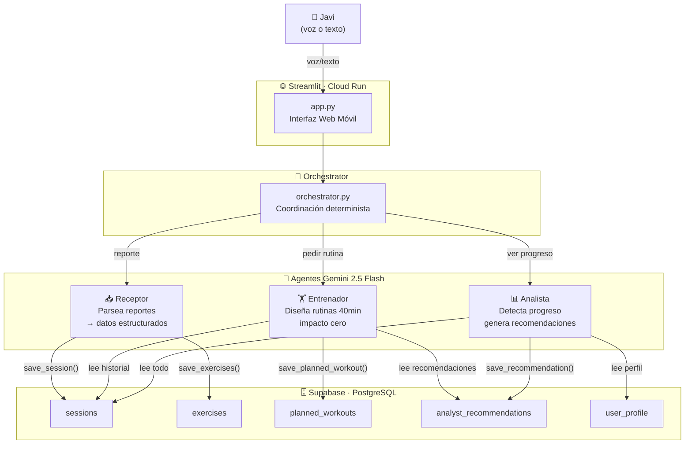
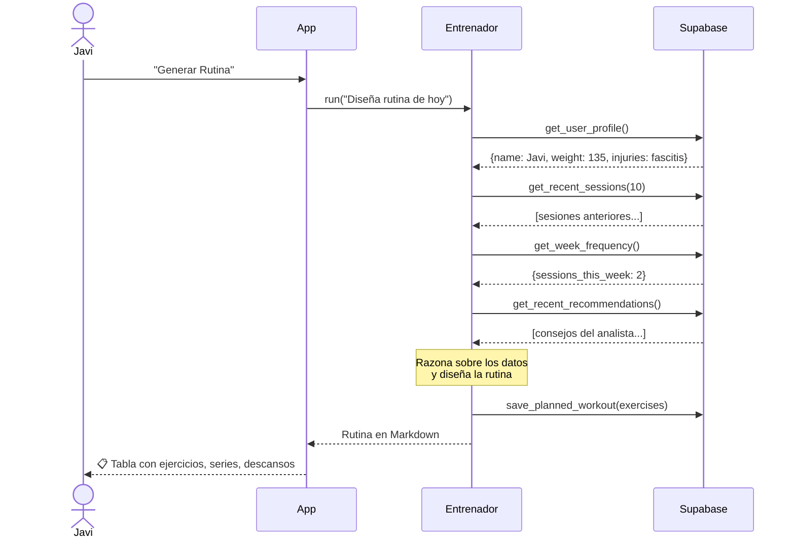
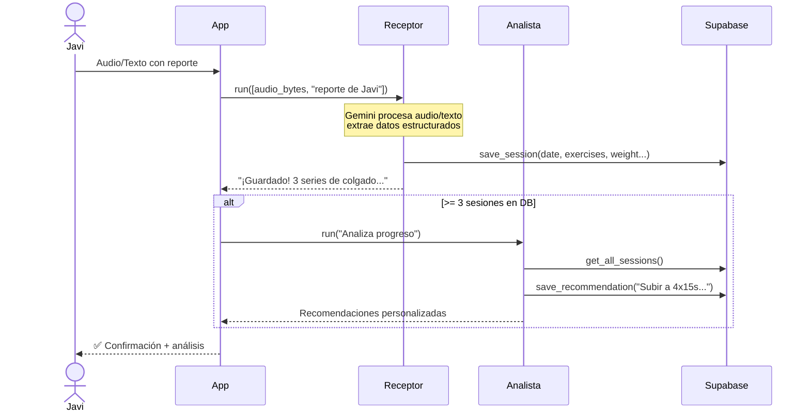

# 💪 Calistenia Coach — Sistema Multi-Agente con IA

> Entrenador personal adaptativo construido con **programación agéntica**.  
> Aprende de cada sesión de Javi y ajusta las rutinas automáticamente.

**🌐 App en producción:** https://calistenia-coach-8285977376.europe-west1.run.app

---

## 🧠 ¿Qué es la Programación Agéntica?

Un **agente** no es un chatbot. Es un LLM que puede **actuar** en el mundo real
a través de herramientas (tools), decidiendo autónomamente qué hacer y cuándo.

```
┌─────────────────────────────────────────────────────────────┐
│                   EL BUCLE AGÉNTICO                         │
│                                                             │
│   Tu mensaje                                                │
│       │                                                     │
│       ▼                                                     │
│   ┌───────┐    "Necesito ver el historial"    ┌──────────┐ │
│   │  LLM  │ ──────────────────────────────►  │ Tool:    │ │
│   │       │ ◄──────────────────────────────  │ get_     │ │
│   │       │    {sesiones: [...]}              │ sessions │ │
│   │       │                                  └──────────┘ │
│   │       │    "Necesito guardar el plan"     ┌──────────┐ │
│   │       │ ──────────────────────────────►  │ Tool:    │ │
│   │       │ ◄──────────────────────────────  │ save_    │ │
│   │       │    {status: "ok"}                │ workout  │ │
│   │       │                                  └──────────┘ │
│   │       │                                               │
│   │       │    "Ya tengo todo. Aquí tu rutina:"           │
│   └───────┘ ──────────────────────────────► Respuesta     │
│                                             final          │
└─────────────────────────────────────────────────────────────┘

 El LLM decide AUTÓNOMAMENTE:
   ✓ Qué tools usar        ✓ En qué orden
   ✓ Cuántas veces         ✓ Con qué parámetros
```

---

## 🏗️ Arquitectura del Sistema



---

## 🔄 Flujos Principales

### 1. Pedir rutina de hoy


### 2. Reportar sesión (voz o texto)


---

## 📁 Estructura del Proyecto

```
calistenia/
│
├── app.py                  # Interfaz Streamlit (web móvil) — con Google OAuth
├── main.py                 # CLI para uso local / Termux Android
├── database.py             # Capa de datos (Supabase SDK)
├── migration.py            # Auto-creación de tablas en Cloud Run
├── voice.py                # Grabación de audio (desktop)
├── supabase_schema.sql     # SQL para crear tablas manualmente
│
├── scripts/
│   ├── run_simulator.py    # 🧪 Genera sesiones ficticias en Supabase
│   └── run_arp.py          # 🤖 Ejecuta el ARP Evolver (analiza + reescribe prompts)
│
├── agents/
│   ├── base.py             # ⭐ BUCLE AGÉNTICO EXPLÍCITO (leer primero)
│   ├── orchestrator.py     # Coordinación entre agentes
│   ├── receptor.py         # Agente 1: parseo de reportes
│   ├── trainer.py          # Agente 2: diseño de rutinas
│   ├── analyst.py          # Agente 3: análisis de progreso
│   ├── simulator.py        # Agente 4: generación de datos de sesión (sin tool loop)
│   ├── arp_evolver.py      # Agente 5: meta-agente de mejora autónoma del sistema
│   └── agent_manager.py    # Tools para leer/reescribir prompts de agentes
│
├── .streamlit/
│   ├── secrets.toml        # 🔒 Credenciales + config OAuth (no en git)
│   └── secrets.toml.example # Plantilla con instrucciones
│
├── docker_entrypoint.sh    # Genera secrets.toml desde env vars al arrancar en Cloud Run
├── .env                    # 🔒 Credenciales locales (no en git)
├── requirements.txt        # Dependencias Python
├── Dockerfile              # Contenedor para Cloud Run
└── deploy_cloud.ps1        # Script de despliegue — incluye vars OAuth
```

---

## 🛠️ Stack Tecnológico

| Capa | Tecnología | Por qué |
|---|---|---|
| **LLM** | Google Gemini 2.5 Flash | Gratuito, soporta audio nativo, function calling |
| **Agent SDK** | `google-genai` | Automatic function calling, multimodal |
| **Base de datos** | Supabase (PostgreSQL) | Persiste entre reinicios de Cloud Run, gratis |
| **Interfaz web** | Streamlit | Rapid prototyping, `st.audio_input()` para móvil |
| **Despliegue** | Google Cloud Run | Escala a cero (coste ~0 en desuso), HTTPS gratis |
| **Contenedor** | Docker | Reproducible en cualquier entorno |

---

## 🤖 Los 5 Agentes

### 📥 Receptor (`agents/receptor.py`)
- **Modelo:** Gemini 2.5 Flash
- **Input:** Texto libre o audio (webm/wav)
- **Tools:** `get_user_profile`, `save_session`
- **Misión:** Convertir "hoy he hecho 3 series de colgado y me ha dolido el pie" en datos estructurados guardados en Supabase

### 🏋️ Entrenador (`agents/trainer.py`)
- **Modelo:** Gemini 2.5 Flash
- **Input:** Petición de rutina
- **Tools:** `get_user_profile`, `get_recent_sessions`, `get_week_frequency`, `get_days_since_last_session`, `get_recent_recommendations`, `save_planned_workout`
- **Misión:** Diseñar rutina de 40min de impacto cero adaptada al historial real de Javi

### 📊 Analista (`agents/analyst.py`)
- **Modelo:** Gemini 2.5 Flash
- **Input:** Petición de análisis (se activa automáticamente tras ≥3 sesiones)
- **Tools:** `get_user_profile`, `get_all_sessions`, `get_exercise_history`, `save_recommendation`
- **Misión:** Detectar progreso, estancamientos, y dejar recomendaciones para el Entrenador

### 🧪 Simulador (`agents/simulator.py`)
- **Modelo:** Gemini 2.5 Flash
- **Input:** Fecha de inicio + número de días
- **Tools:** `save_session`, `get_all_sessions`
- **Misión:** Generar datos ficticios de entrenamiento realistas para poblar la DB (desarrollo/testing)
- **Uso:** `python run_simulator.py --start 2026-03-01 --days 28`

### 🔄 ARP Evolver (`agents/arp_evolver.py`)
- **Modelo:** Gemini 2.5 Flash
- **Input:** Petición de análisis global
- **Tools:** `get_all_sessions`, `get_recent_recommendations`, `save_recommendation`
- **Misión:** Meta-agente que analiza patrones en los datos reales y propone mejoras concretas a los system prompts de los otros agentes
- **Uso:** `python run_arp.py`

---

## 🗄️ Schema de Base de Datos

```
user_profile          sessions              exercises
─────────────         ─────────────         ─────────────
id (PK)               id (PK)               id (PK)
name                  planned_workout_id ──► session_id (FK)
age                   date                  name
initial_weight        weight                sets
current_weight        duration_minutes      reps
injuries              fatigue_level         seconds
goals                 general_notes         weight
last_updated          created_at            difficulty
                                            notes

planned_workouts      analyst_recommendations
─────────────         ───────────────────────
id (PK)               id (PK)
date                  date
focus                 recommendation
total_duration_min    created_at
exercises_json
status (PENDING/COMPLETED)
created_at
```

---

## 🚀 Instalación y Uso

### Requisitos
- Python 3.11+
- Cuenta en [Google AI Studio](https://aistudio.google.com/) (API key gratuita)
- Cuenta en [Supabase](https://supabase.com/) (tier gratuito)
- `gcloud` CLI (solo para despliegue en Cloud Run)

### Setup local
```bash
git clone https://github.com/JavierRubio4U/calistenia.git
cd calistenia

# Entorno virtual
python -m venv venv
source venv/Scripts/activate   # Windows
# source venv/bin/activate     # Mac/Linux

# Dependencias
pip install -r requirements.txt

# Variables de entorno
cp .env.example .env
# Editar .env con tus claves
```

### Crear tablas en Supabase (una sola vez)
1. Ve a https://supabase.com/dashboard → tu proyecto → **SQL Editor**
2. Pega el contenido de `supabase_schema.sql`
3. Ejecuta → "Success"

### Ejecutar
```bash
# Web (Streamlit)
streamlit run app.py

# CLI
python main.py
```

### Desplegar en Cloud Run
```powershell
# Windows PowerShell
.\deploy_cloud.ps1
```

---

## 📱 Uso en Android (Termux)

```bash
pkg update && pkg install python git
git clone https://github.com/JavierRubio4U/calistenia.git
cd calistenia
python -m venv venv
source venv/bin/activate
pip install -r requirements.txt
cp .env.example .env
nano .env   # pega tus claves
python main.py
```

**Para voz en Android:** usa el teclado Gboard con el icono del micrófono — dictas y el texto aparece directamente en la terminal.

---

## 🔑 Variables de Entorno

| Variable | Descripción | Dónde obtenerla |
|---|---|---|
| `GEMINI_API_KEY` | API key de Google Gemini | [aistudio.google.com](https://aistudio.google.com/apikey) |
| `SUPABASE_URL` | URL del proyecto Supabase | Dashboard → Settings → API |
| `SUPABASE_KEY` | Anon/public key de Supabase | Dashboard → Settings → API |

---

## 💡 Conceptos Clave para Aprender

### ¿Qué hace a esto "agéntico" y no solo un chatbot?

```
CHATBOT normal:           AGENTE:
─────────────────         ─────────────────────────────────────
Tú → pregunta             Tú → objetivo
LLM → respuesta           LLM → decide qué info necesita
                               → llama tools para obtenerla
                               → razona sobre los resultados
                               → vuelve a llamar tools si necesita más
                               → genera respuesta basada en datos reales
```

### Comunicación asíncrona entre agentes
El **Analista** no habla directamente con el **Entrenador**.
En su lugar, escribe recomendaciones en Supabase → el Entrenador las lee en la siguiente petición.

```
Analista ──[save_recommendation()]──► Supabase
Entrenador ◄──[get_recent_recommendations()]── Supabase
```

Este patrón se llama **Shared State** y es uno de los más comunes en sistemas multi-agente.

### Orquestación determinista vs. con LLM
Este proyecto usa **orquestación determinista** (Python puro en `orchestrator.py`):
- Pides rutina → llama al Entrenador
- Reportas sesión → llama al Receptor, luego opcionalmente al Analista

Una alternativa sería usar otro LLM para decidir qué agente invocar (más flexible, más caro).
