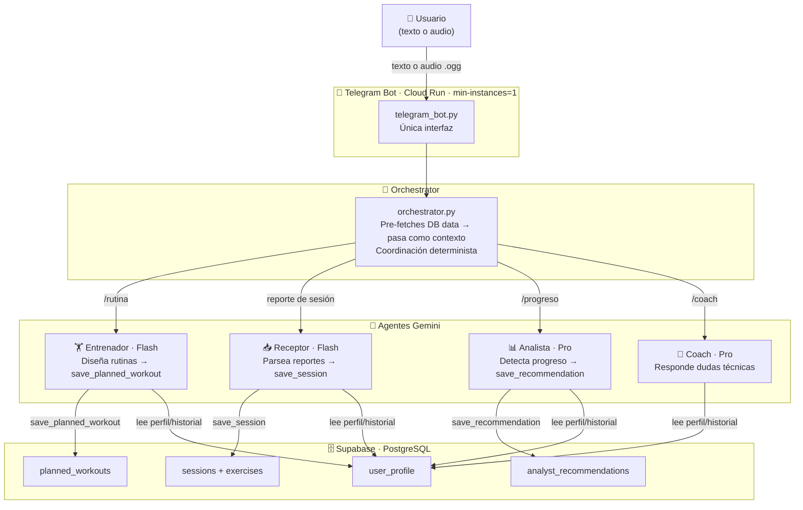
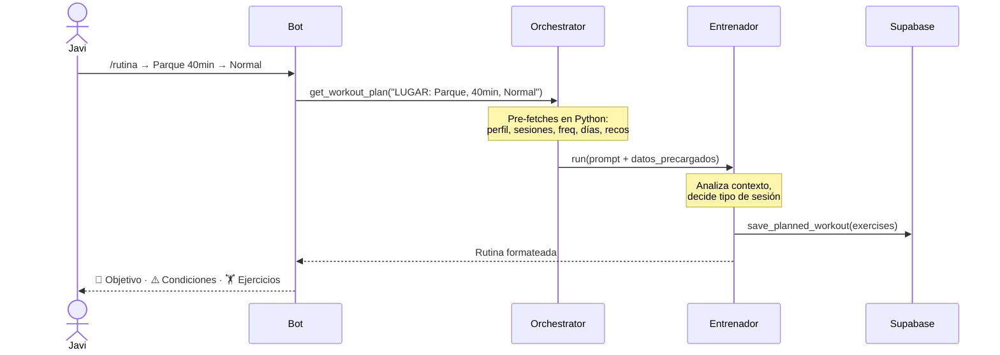
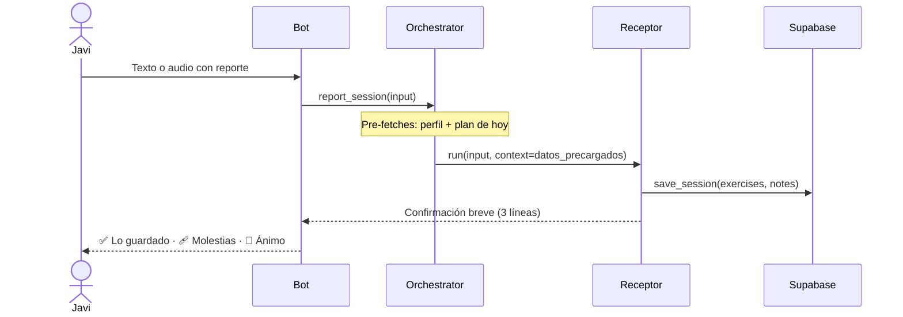

# 💪 Calistenia Coach — Sistema Multi-Agente con IA

> Entrenador personal adaptativo construido con **programación agéntica**.  
> Aprende de cada sesión y ajusta las rutinas automáticamente según historial real.

**🤖 Interfaz:** Bot de Telegram (única interfaz — `@CalisteniaCoachBot`)

---

## 🧠 ¿Qué es la Programación Agéntica?

Un **agente** no es un chatbot. Es un LLM que puede **actuar** en el mundo real
a través de herramientas (tools), decidiendo autónomamente qué hacer y cuándo.

```
┌─────────────────────────────────────────────────────────────┐
│                   EL BUCLE AGÉNTICO                         │
│                                                             │
│   Tu mensaje                                                │
│       │                                                     │
│       ▼                                                     │
│   ┌───────┐    "Necesito ver el historial"    ┌──────────┐ │
│   │  LLM  │ ──────────────────────────────►  │ Tool:    │ │
│   │       │ ◄──────────────────────────────  │ get_     │ │
│   │       │    {sesiones: [...]}              │ sessions │ │
│   │       │                                  └──────────┘ │
│   │       │    "Necesito guardar el plan"     ┌──────────┐ │
│   │       │ ──────────────────────────────►  │ Tool:    │ │
│   │       │ ◄──────────────────────────────  │ save_    │ │
│   │       │    {status: "ok"}                │ workout  │ │
│   │       │                                  └──────────┘ │
│   │       │                                               │
│   │       │    "Ya tengo todo. Aquí tu rutina:"           │
│   └───────┘ ──────────────────────────────► Respuesta     │
│                                             final          │
└─────────────────────────────────────────────────────────────┘

 El LLM decide AUTÓNOMAMENTE:
   ✓ Qué tools usar        ✓ En qué orden
   ✓ Cuántas veces         ✓ Con qué parámetros
```

---

## 🏗️ Arquitectura del Sistema



---

## 📱 Interfaz: Bot de Telegram

El bot es la **única interfaz** del sistema. HTTP polling sobre Cloud Run con `min-instances=1` para mantenerlo siempre activo.

```
/start · /menu   → Menú con 4 botones
/rutina          → Selecciona lugar+tiempo (6 botones) → cómo estás (3 botones) → rutina
/progreso        → Análisis de evolución bajo demanda
/coach           → Consulta técnica (texto o audio)
/admin           → Resumen de usuarios (solo admin)
Texto libre      → Receptor: registra la sesión de entrenamiento
Audio .ogg       → Receptor multimodal: Gemini procesa el audio directamente
```

**Flujo para pedir rutina:**
```
Usuario: /rutina
Bot: ¿Dónde y cuánto tiempo?
     [🌳 Parque 30min] [🌳 Parque 40min] [🌳 Parque 60min]
     [🏠 Casa 30min]   [🏠 Casa 40min]   [🏠 Casa 60min]

Usuario: 🌳 Parque 40min
Bot: ¿Cómo estás hoy?
     [😓 Mal] [😐 Normal] [💪 Bien]

Usuario: 😐 Normal
Bot: 🧠 Analizando y armando tu sesión...

     🎯 *Objetivo:* Colgarte 15 segundos en barra
     ⚠️ *Teniendo en cuenta:* Fascitis plantar

     💪 Vamos allá!
     🏋️ *Colgado en barra* — 3×12s — 90s
     🏋️ *Remo australiano* — 3×8 — 90s
     ...
```

---

## ⚡ Optimización de velocidad

El mayor cuello de botella en sistemas multi-agente es el número de **round-trips al modelo** (cada tool call = 1 llamada LLM + respuesta).

**Solución aplicada — Pre-fetch en el Orquestador:**

```
ANTES (agéntico puro):          AHORA (pre-fetch + agéntico):
─────────────────────────       ──────────────────────────────
LLM → get_user_profile()   ✗   Python pre-fetches en paralelo
LLM → get_recent_sessions() ✗   → pasa como contexto al LLM
LLM → get_week_frequency()  ✗   LLM solo llama:
LLM → get_days_since_last() ✗     → save_planned_workout ✓
LLM → get_recommendations() ✗   
LLM → save_planned_workout  ✓   
= 6 round-trips                 = 2 round-trips
```

Los agentes (Entrenador, Receptor) solo tienen **tools de escritura** — los datos de lectura llegan pre-cargados en el contexto del mensaje.

---

## 🔄 Flujos Principales

### 1. Pedir rutina de hoy


### 2. Reportar sesión


---

## 🤖 Los Agentes

### 📥 Receptor (`agents/receptor.py`)
- **Modelo:** Gemini Flash
- **Tools:** solo `save_session` (datos pre-cargados en contexto)
- **Lógica:** lee el plan de hoy del contexto, compara con lo reportado, guarda
- **Respuesta:** máximo 3 líneas — qué se guardó, si hay molestia, frase de ánimo

### 🏋️ Entrenador (`agents/trainer.py`)
- **Modelo:** Gemini Flash
- **Tools:** solo `save_planned_workout` + `set_next_milestone` (datos pre-cargados)
- **Lógica data-driven:** analiza frecuencia semanal, días consecutivos, grupos musculares, molestias recientes → decide tipo de sesión
- **Output:** cabecera con 🎯 objetivo actual + ⚠️ condiciones activas, luego lista de ejercicios
- **Protocolos:** Parque (barras, colgado, equilibrio, inversión) / Casa (mancuernas, esterilla)

### 📊 Analista (`agents/analyst.py`)
- **Modelo:** Gemini Pro
- **Tools:** `get_all_sessions`, `get_exercise_history`, `save_recommendation`
- **Activación:** solo bajo demanda con `/progreso`
- **Regla de fatiga:** nunca inventa valores — solo reporta si hay datos reales

### 💬 Coach (`agents/coach.py`)
- **Modelo:** Gemini Pro
- **Tools:** `get_user_profile`, `get_recent_sessions`, `get_recent_recommendations` (solo lectura)
- **Misión:** responde dudas de técnica, adaptaciones por lesión, nutrición básica

### 🧪 Simulador (`agents/simulator.py`)
- **Uso:** `python scripts/run_simulator.py --start 2026-03-01 --days 28`
- **Genera sesiones ficticias realistas para poblar la DB en desarrollo**

### 🔄 ARP Evolver (`agents/arp_evolver.py`)
- **Meta-agente** que analiza patrones y propone mejoras a los system prompts
- **Uso:** `python scripts/run_arp.py`

---

## 🗄️ Schema de Base de Datos

```
user_profile          sessions              exercises
─────────────         ─────────────         ─────────────
user_email            user_email            session_id (FK)
name                  planned_workout_id    name
age                   date                  sets
initial_weight        weight                reps
current_weight        duration_minutes      seconds
injuries              fatigue_level         weight
goals                 general_notes         difficulty
home_equipment        created_at            notes
next_milestone
last_updated

planned_workouts      analyst_recommendations
─────────────         ───────────────────────
user_email            user_email
date                  date
focus                 recommendation
total_duration_min    created_at
exercises_json
status (PENDING/COMPLETED)
```

---

## 📁 Estructura del Proyecto

```
calistenia/
│
├── telegram_bot.py         # 📱 Bot de Telegram (única interfaz)
├── main.py                 # 💻 CLI local / Termux Android
├── database.py             # 🗄️ Capa de datos (Supabase SDK)
├── migration.py            # Auto-creación de tablas en Cloud Run
├── supabase_schema.sql     # SQL para crear tablas manualmente
│
├── agents/
│   ├── base.py             # ⭐ BUCLE AGÉNTICO EXPLÍCITO (leer primero)
│   ├── orchestrator.py     # Pre-fetch de datos + coordinación entre agentes
│   ├── receptor.py         # Agente: registra sesiones (solo save_session)
│   ├── trainer.py          # Agente: diseña rutinas (solo write tools)
│   ├── analyst.py          # Agente: análisis de progreso bajo demanda
│   ├── coach.py            # Agente: consultas técnicas
│   ├── simulator.py        # Agente: generación de datos de prueba
│   └── arp_evolver.py      # Meta-agente: mejora autónoma de prompts
│
├── scripts/
│   ├── run_simulator.py    # Genera sesiones ficticias
│   └── run_arp.py          # Ejecuta el ARP Evolver
│
├── Dockerfile.telegram     # Contenedor del bot (Cloud Run)
├── deploy_telegram.ps1     # Deploy a Cloud Run (min-instances=1)
├── cloudbuild.telegram.yaml # Config Cloud Build
│
├── .env                    # 🔒 Variables locales (no en git — ver .env.example)
└── requirements.txt        # Dependencias Python
```

---

## 🛠️ Stack Tecnológico

| Capa | Tecnología | Por qué |
|---|---|---|
| **LLM** | Google Gemini (Flash + Pro) | Soporta audio nativo, function calling, multimodal |
| **Agent SDK** | `google-genai` | Tool loop, automatic function calling |
| **Base de datos** | Supabase (PostgreSQL) | Persiste entre reinicios, tier gratuito |
| **Interfaz** | python-telegram-bot 20.x | HTTP polling — no depende de WebSocket, perfecto para móvil |
| **Despliegue** | Google Cloud Run | `min-instances=1` mantiene el bot vivo, HTTPS gratis |
| **Contenedor** | Docker | Reproducible en cualquier entorno |

---

## 🚀 Instalación y Uso

### Requisitos
- Python 3.11+
- Cuenta en [Google AI Studio](https://aistudio.google.com/) (API key gratuita)
- Cuenta en [Supabase](https://supabase.com/) (tier gratuito)
- Bot de Telegram creado con [@BotFather](https://t.me/botfather)
- `gcloud` CLI (solo para despliegue en Cloud Run)

### Setup local
```bash
git clone https://github.com/JavierRubio4U/calistenia.git
cd calistenia

python -m venv venv
source venv/Scripts/activate   # Windows
# source venv/bin/activate     # Mac/Linux

pip install -r requirements.txt

cp .env.example .env
# Editar .env con tus claves
```

### Crear tablas en Supabase (una sola vez)
1. Ve a https://supabase.com/dashboard → tu proyecto → **SQL Editor**
2. Pega el contenido de `supabase_schema.sql`
3. Ejecuta → "Success"

### Ejecutar localmente
```bash
# Bot Telegram
python telegram_bot.py

# CLI (sin Telegram)
python main.py
```

### Desplegar en Cloud Run
```powershell
.\deploy_telegram.ps1
```

---

## 🔑 Variables de Entorno

| Variable | Descripción | Dónde obtenerla |
|---|---|---|
| `GEMINI_API_KEY` | API key de Google Gemini | [aistudio.google.com](https://aistudio.google.com/apikey) |
| `SUPABASE_URL` | URL del proyecto Supabase | Dashboard → Settings → API |
| `SUPABASE_KEY` | Anon/public key de Supabase | Dashboard → Settings → API |
| `TELEGRAM_BOT_TOKEN` | Token del bot | [@BotFather](https://t.me/botfather) → /newbot |
| `TELEGRAM_ALLOWED_CHAT_ID` | Tu chat_id personal | [@RawDataBot](https://t.me/rawdatabot) |
| `CLI_USER_EMAIL` | Email del usuario por defecto | El tuyo |

> **Nunca commitees `.env` — ya está en `.gitignore`**

---

## 💡 Conceptos Clave

### ¿Qué hace a esto "agéntico" y no solo un chatbot?

```
CHATBOT normal:           AGENTE:
─────────────────         ─────────────────────────────────────
Tú → pregunta             Tú → objetivo
LLM → respuesta           LLM → decide qué info necesita
                               → llama tools para obtenerla
                               → razona sobre los resultados
                               → vuelve a llamar tools si necesita más
                               → genera respuesta basada en datos reales
```

### Comunicación asíncrona entre agentes (Shared State)
El **Analista** no habla directamente con el **Entrenador**.
Escribe recomendaciones en Supabase → el Entrenador las lee en la siguiente petición.

```
Analista ──[save_recommendation()]──► Supabase
Entrenador ◄──[pre-fetched en contexto]── Orchestrator
```

### Orquestación determinista vs. con LLM
Este proyecto usa **orquestación determinista** (`orchestrator.py`):
- `/rutina` → llama al Entrenador (con datos pre-cargados)
- Texto libre → llama al Receptor (con perfil y plan pre-cargados)
- `/coach` → llama al Coach
- `/progreso` → llama al Analista

Una alternativa sería usar otro LLM para decidir qué agente invocar (más flexible, más caro, más lento).

### Por qué Telegram en lugar de Streamlit
Streamlit usa WebSockets persistentes que se caen en conexiones móviles inestables.
Telegram usa HTTP polling — cada petición es independiente, nunca pierde el estado.
El bot se mantiene vivo en Cloud Run con `min-instances=1`.
